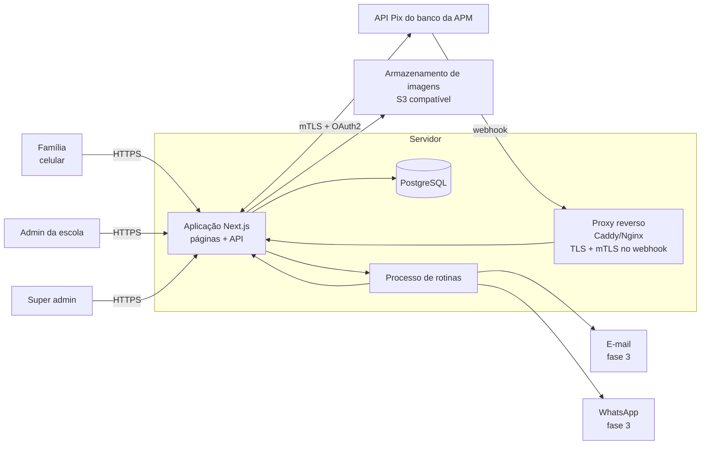
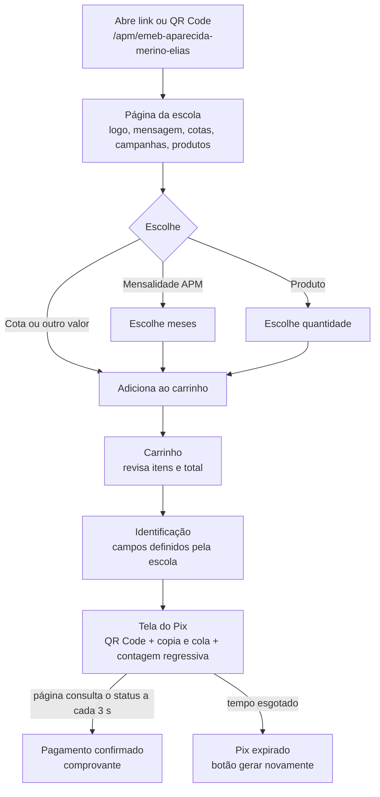

# Plataforma APM — Arquitetura (v0.2)

Sistema web de contribuições, campanhas e vendas para APMs escolares.
Escola piloto: **APM da EMEB Aparecida Merino Elias** — CNPJ 03.604.104/0001-01.

Este documento cobre os 10 itens exigidos antes da codificação (seção 30 da especificação). Ao final há o plano de implementação do MVP e as decisões que ainda dependem da escola.

---

## Mudanças desde a v0.1

- **Banco escolhido: Banco do Brasil**, chave Pix CNPJ. Adaptador `BancoDoBrasilProvider` (API Pix v2, mTLS) implementado.
- **Prisma → Drizzle ORM**: sem binários externos, SQL explícito e controle direto das políticas de RLS.
- **pg-boss → processo de rotinas simples** (`scripts/jobs.ts`), suficiente para uma escola; troca por fila dedicada fica para a fase 4.

## 0. Duas decisões que orientam todo o projeto

### 0.1 "O dinheiro vai direto para a conta da APM" → API Pix padrão Banco Central

A exigência de que o dinheiro não passe por conta intermediária elimina o modelo de "gateway marketplace" (subcontas, split de pagamento), em que o dinheiro cai primeiro na conta da plataforma e depois é repassado.

A arquitetura adotada é: **cada APM usa a API Pix da instituição onde ela mesma tem conta**. O Banco Central definiu um padrão único para essa API (endpoints `/cob`, `/pix`, `/webhook`), implementado por Efí, Banco do Brasil, Inter, Sicoob, Sicredi, Itaú, Santander e outros. Consequências:

- O Pix é creditado **na conta da APM**, na chave CNPJ que ela já usa hoje.
- A plataforma só guarda as credenciais da API (criptografadas) e nunca movimenta dinheiro.
- Um único adaptador "Padrão Bacen" atende quase todos os bancos; diferenças pontuais (autenticação, formato do webhook) ficam em pequenas classes específicas.
- Mercado Pago também é aceitável **se a conta for da própria APM** (não da plataforma); por isso ele entra como segundo adaptador possível, não como padrão.

### 0.2 O sistema substitui o envelope mensal em papel

O envelope atual controla contribuições **por estudante e por mês** (janeiro a dezembro), aceita **dinheiro ou Pix** e tem um campo **"visto escola"**. Hoje, quem paga por Pix precisa escrever o nome do titular para a escola conseguir identificar o pagamento — exatamente o problema que o Pix dinâmico (com `txid` por pedido) resolve.

Por isso o modelo inclui:

- **Contribuição mensal com mês de referência** (a família pode pagar setembro e outubro no mesmo carrinho).
- **Relatório "Envelope digital"**: matriz estudante × mês, com o "visto" preenchido automaticamente quando o Pix é confirmado.
- **Lançamento manual em dinheiro** pelo painel (auditado), para que a escola não precise manter dois controles durante a transição. Pix continua sendo a única forma de pagamento *online*.
- **Conciliação de Pix avulsos**: Pix recebidos na chave CNPJ sem pedido (como acontece hoje) aparecem numa fila para a tesouraria vincular manualmente.

---

## 1. Arquitetura completa



| Componente | Tecnologia | Função |
|---|---|---|
| Frontend | Next.js 15 (App Router) + React + TypeScript + Tailwind | Página pública da escola, carrinho, tela do Pix, painel administrativo. Páginas públicas renderizadas no servidor (carregam rápido em celular e 4G fraco). |
| Backend | O mesmo projeto Next.js (Route Handlers e Server Actions) | Regras de negócio, cálculo de preços, criação de cobranças, webhooks. Um único projeto reduz custo e manutenção. As regras ficam em uma camada `services/` independente do framework, para permitir separar a API no futuro. |
| Validação | Zod | Toda entrada é validada no servidor, com os mesmos esquemas reaproveitados no formulário. |
| Banco de dados | PostgreSQL 16 + Drizzle ORM | Dados relacionais, transações, bloqueio de linha para estoque, Row Level Security para multi-tenant. |
| Rotinas | Processo `npm run jobs` separado da aplicação web | Expiração de pedidos, reconsulta de cobranças pendentes, conciliação diária. Sem Redis no MVP. |
| Autenticação | Sessões próprias em banco + senha com Argon2id + cookie httpOnly | Controle total, revogação imediata de sessão, sem dependência externa. |
| Imagens | Armazenamento S3 compatível (Cloudflare R2, AWS S3 ou MinIO) | Logos, fotos de campanhas e produtos. Upload validado (tipo, tamanho) e redimensionado no servidor. |
| Integração Pix | Camada `PixProvider` com adaptadores | Isola o banco escolhido do resto do sistema (ver item 10). |
| Webhooks | Endpoint `/api/webhooks/pix/{escola}/{segredo}` atrás do proxy com mTLS | Recebe avisos do banco, grava o evento bruto, reconsulta a cobrança e confirma. |
| Hospedagem | Contêiner Docker em VPS ou PaaS com região São Paulo + PostgreSQL gerenciado | O webhook padrão Bacen exige mTLS de entrada, o que plataformas serverless (ex.: Vercel) não oferecem. Um proxy próprio resolve. |
| Backups | Backup contínuo (PITR) do PostgreSQL gerenciado + dump diário criptografado em outro provedor, retenção de 35 dias, teste de restauração mensal | Proteção contra perda de dados e erro humano. Imagens com versionamento no bucket. |
| Observabilidade | Logs estruturados (pino) + Sentry + alerta de "webhook sem resposta" | Detectar rapidamente falhas de pagamento. |

Estrutura de pastas do código:

```
apm-plataforma/
├── drizzle/          migrações SQL + RLS
├── src/
│   ├── app/
│   │   ├── (publico)/apm/[slug]/...      página da escola, carrinho, pagamento
│   │   ├── (admin)/painel/...            painel da escola
│   │   ├── (super)/super/...             super admin
│   │   └── api/webhooks/pix/...          webhooks
│   ├── services/     pedidos, estoque, pagamentos, relatórios (regras de negócio)
│   ├── pix/          interface PixProvider + adaptadores
│   ├── auth/         sessões, senhas, permissões
│   ├── tenancy/      resolução da escola e cliente Prisma com escopo
│   ├── jobs/         expiração, conciliação, notificações
│   └── lib/          dinheiro, validação, auditoria, criptografia
└── docs/
```

---

## 2. Modelo de banco de dados

> Implementação: `src/db/schema.ts` (Drizzle). O resumo abaixo foi escrito na proposta inicial e continua válido nas entidades e regras; nomes de colunas no banco estão em snake_case.

Princípios:

- **Valores sempre em centavos (inteiro)**. Nunca ponto flutuante para dinheiro.
- **Toda tabela de negócio tem `escolaId`** (multi-tenant).
- **Itens do pedido guardam cópia de nome e preço** no momento da compra (alterar o preço depois não muda pedidos antigos).
- **Cotas e produtos são a mesma entidade** (`Item`), diferenciada por `tipo`. Isso simplifica carrinho, pedidos e relatórios.
- **Status do pagamento separado do status do pedido**, e **status de entrega** separado para produtos físicos.

```text
enum PerfilUsuario    { SUPER_ADMIN ADMIN_ESCOLA FINANCEIRO OPERADOR LEITURA }
enum StatusCampanha   { RASCUNHO ATIVA PAUSADA ENCERRADA }
enum TipoItem         { COTA VALOR_LIVRE CONTRIBUICAO_MENSAL PRODUTO }
enum StatusPedido     { AGUARDANDO_PAGAMENTO PIX_GERADO PAGO CANCELADO EXPIRADO ESTORNADO }
enum StatusEntrega    { NAO_SE_APLICA PENDENTE ENTREGUE }
enum StatusPagamento  { CRIADO ATIVO CONCLUIDO EXPIRADO REMOVIDO DEVOLVIDO }
enum FormaPagamento   { PIX DINHEIRO }
enum ModoIdentificacao{ IDENTIFICADA PARCIAL ANONIMA }

model Escola {
  id                 String   @id @default(uuid())
  slug               String   @unique            // "emeb-aparecida-merino-elias"
  nome               String
  nomeApm            String
  cnpjApm            String
  logoUrl            String?
  endereco           String?
  telefone           String?
  email              String?
  corPrimaria        String   @default("#E6457A")
  corSecundaria      String   @default("#3BA7E0")
  mensagemInicial    String?
  mensagemAgradecimento String?
  modoIdentificacao  ModoIdentificacao @default(IDENTIFICADA)
  camposFormulario   Json     // quais campos aparecem e quais são obrigatórios
  valorMinimoLivreCentavos Int @default(500)
  expiracaoPixSegundos     Int @default(1800)
  proximoNumeroPedido      Int @default(1)
  ativa              Boolean  @default(true)
  criadoEm           DateTime @default(now())
  credencialPix      CredencialPix?
  turmas             Turma[]
  campanhas          Campanha[]
  itens              Item[]
  pedidos            Pedido[]
  usuarios           Usuario[]
}

model CredencialPix {                 // uma por escola; segredos criptografados (AES-256-GCM)
  id                 String  @id @default(uuid())
  escolaId           String  @unique
  provedor           String            // "efi", "bb", "inter", "mercadopago"...
  ambiente           String            // "homologacao" | "producao"
  chavePix           String
  clientIdCifrado    String
  clientSecretCifrado String
  certificadoCifrado Bytes?            // .p12 para mTLS
  segredoWebhook     String            // compõe a URL do webhook
  webhookRegistradoEm DateTime?
  atualizadoEm       DateTime @updatedAt
  escola             Escola  @relation(fields: [escolaId], references: [id])
}

model Usuario {
  id           String   @id @default(uuid())
  escolaId     String?                  // nulo apenas para SUPER_ADMIN
  nome         String
  email        String   @unique
  senhaHash    String                   // Argon2id
  perfil       PerfilUsuario
  ativo        Boolean  @default(true)
  totpSegredo  String?                  // 2FA (obrigatório para SUPER_ADMIN e FINANCEIRO)
  ultimoLogin  DateTime?
  escola       Escola?  @relation(fields: [escolaId], references: [id])
  sessoes      Sessao[]
}

model Sessao {
  id         String   @id              // hash do token; o token puro só existe no cookie
  usuarioId  String
  expiraEm   DateTime
  ip         String?
  userAgent  String?
  usuario    Usuario  @relation(fields: [usuarioId], references: [id])
}

model Turma {
  id        String @id @default(uuid())
  escolaId  String
  nome      String                     // "5º A"
  ativa     Boolean @default(true)
  escola    Escola @relation(fields: [escolaId], references: [id])
  @@unique([escolaId, nome])
}

model Campanha {
  id           String   @id @default(uuid())
  escolaId     String
  slug         String
  nome         String
  descricao    String?
  textoApresentacao String?
  imagemUrl    String?
  dataInicio   DateTime
  dataFim      DateTime?
  status       StatusCampanha @default(RASCUNHO)
  metaCentavos Int?
  valorMinimoCentavos Int?
  ordem        Int      @default(0)
  escola       Escola   @relation(fields: [escolaId], references: [id])
  itens        Item[]
  @@unique([escolaId, slug])
}

model Item {                           // cota, valor livre, contribuição mensal ou produto
  id                String   @id @default(uuid())
  escolaId          String
  campanhaId        String
  tipo              TipoItem
  nome              String
  descricao         String?
  imagemUrl         String?
  precoCentavos     Int?                // nulo em VALOR_LIVRE
  controlaEstoque   Boolean  @default(false)
  estoqueTotal      Int?
  estoqueReservado  Int      @default(0)
  estoqueVendido    Int      @default(0)
  limitePorPedido   Int?
  inicioVenda       DateTime?
  fimVenda          DateTime?
  ativo             Boolean  @default(true)
  ordem             Int      @default(0)
  versao            Int      @default(0) // controle otimista
  escola            Escola   @relation(fields: [escolaId], references: [id])
  campanha          Campanha @relation(fields: [campanhaId], references: [id])
  // disponível = estoqueTotal - estoqueReservado - estoqueVendido
}

model Pedido {
  id               String   @id @default(uuid())
  escolaId         String
  codigo           String                // "APM-000123", sequencial por escola
  tokenAcesso      String   @unique      // link do comprovante sem login
  responsavelNome  String?
  responsavelEmail String?
  responsavelTelefone String?
  alunoNome        String?
  turmaId          String?
  observacao       String?
  anonimo          Boolean  @default(false)
  totalCentavos    Int
  status           StatusPedido @default(AGUARDANDO_PAGAMENTO)
  statusEntrega    StatusEntrega @default(NAO_SE_APLICA)
  formaPagamento   FormaPagamento @default(PIX)
  expiraEm         DateTime
  pagoEm           DateTime?
  criadoEm         DateTime @default(now())
  lancadoPorId     String?               // usuário que lançou pagamento em dinheiro
  escola           Escola   @relation(fields: [escolaId], references: [id])
  itens            ItemPedido[]
  pagamentos       Pagamento[]
  @@unique([escolaId, codigo])
  @@index([escolaId, status, criadoEm])
}

model ItemPedido {
  id                   String @id @default(uuid())
  pedidoId             String
  itemId               String
  campanhaId           String
  descricao            String            // cópia do nome no momento da compra
  mesReferencia        String?           // "2026-09" em CONTRIBUICAO_MENSAL
  quantidade           Int
  valorUnitarioCentavos Int
  valorTotalCentavos   Int
  pedido               Pedido @relation(fields: [pedidoId], references: [id])
}

model Pagamento {
  id              String   @id @default(uuid())
  escolaId        String
  pedidoId        String
  provedor        String
  txid            String   @unique      // 26 a 35 caracteres, gerado por nós
  endToEndId      String?  @unique      // identificador do Pix no Banco Central
  valorCentavos   Int
  valorPagoCentavos Int?
  pixCopiaECola   String?
  qrCodeImagem    String?               // SVG/PNG gerado a partir do copia e cola
  status          StatusPagamento @default(CRIADO)
  pagadorNomeCifrado String?            // quando o banco informa; acesso restrito
  criadoEm        DateTime @default(now())
  pagoEm          DateTime?
  expiraEm        DateTime
  pedido          Pedido   @relation(fields: [pedidoId], references: [id])
}

model EventoWebhook {                  // registro bruto para auditoria
  id           String   @id @default(uuid())
  escolaId     String?
  provedor     String
  recebidoEm   DateTime @default(now())
  ip           String?
  corpo        Json
  valido       Boolean
  processadoEm DateTime?
  erro         String?
}

model PixAvulso {                      // Pix recebido na chave sem pedido (conciliação manual)
  id            String   @id @default(uuid())
  escolaId      String
  endToEndId    String   @unique
  valorCentavos Int
  horario       DateTime
  infoPagador   String?
  pedidoId      String?                  // preenchido quando a tesouraria vincula
}

model LogAuditoria {
  id         String   @id @default(uuid())
  escolaId   String?
  usuarioId  String?
  acao       String                      // "item.preco.alterado", "pedido.dinheiro.lancado"...
  entidade   String
  entidadeId String
  antes      Json?
  depois     Json?
  ip         String?
  criadoEm   DateTime @default(now())
}

model Notificacao {                    // outbox: e-mail/WhatsApp enviados por job
  id         String   @id @default(uuid())
  escolaId   String
  evento     String                      // "pagamento.confirmado", "produto.esgotado"...
  canal      String
  destino    String
  payload    Json
  status     String   @default("PENDENTE")
  tentativas Int      @default(0)
  criadoEm   DateTime @default(now())
}
```

---

## 3. Fluxo do usuário (família)



Detalhes que fazem diferença no celular:

- Carrinho guardado no navegador até o pedido ser criado; nada de cadastro ou senha para a família.
- No máximo **4 toques** entre "abrir o link" e "copiar código Pix" para uma cota simples.
- Botão "Copiar código Pix" grande, com confirmação visual; instrução curta sobre abrir o app do banco.
- Se a pessoa fechar a página, o link do pedido (com `tokenAcesso`) permite voltar ao Pix ou ao comprovante.
- Comprovante em página própria e em PDF, com código do pedido, itens, valor, data e identificador da transação.

---

## 4. Fluxo financeiro

1. **O preço é sempre calculado no servidor.** O navegador envia apenas `itemId`, quantidade, mês de referência e, no caso de valor livre, o valor desejado. O servidor busca preços no banco, valida mínimo, limites, datas de venda e estoque, e calcula o total.
2. O pedido é criado com status `AGUARDANDO_PAGAMENTO` e o estoque dos produtos é **reservado** (ver item 5).
3. O servidor cria a cobrança no banco da APM com `txid` próprio, valor fixo (o pagador não pode alterar) e expiração configurável (padrão 30 min). Pedido → `PIX_GERADO`.
4. A família paga no app do banco. **O dinheiro cai na conta da APM**, na chave CNPJ.
5. O banco avisa o sistema (webhook) e o sistema confirma com uma consulta à API (item 5). Pedido → `PAGO`.
6. Cancelamentos após o pagamento geram **devolução Pix** pela própria API (`/pix/{e2eid}/devolucao`), feita por usuário com perfil Financeiro e registrada em auditoria. Pedido → `ESTORNADO`.
7. **Conciliação diária**: o sistema consulta todos os Pix recebidos na chave no dia anterior e compara com os pedidos. Diferenças viram alerta; Pix sem pedido vão para a fila de "Pix avulsos".
8. Pagamentos em dinheiro são lançados manualmente por Financeiro/Admin, com registro de quem lançou e quando. Aparecem separados nos relatórios.

Observação: o comprovante é um **recibo de contribuição/compra emitido pela APM**, não um documento fiscal. Vale confirmar com o contador da APM o tratamento contábil das vendas de produtos.

---

## 5. Fluxo de confirmação Pix

```mermaid
sequenceDiagram
  participant F as Família
  participant S as Sistema
  participant B as API Pix (banco da APM)
  F->>S: Confirmar pedido (itens + dados)
  S->>S: Calcula total, reserva estoque (transação)
  S->>B: PUT /cob/{txid} (valor, chave, expiração)
  B-->>S: pixCopiaECola, status ATIVA
  S-->>F: QR Code + copia e cola
  F->>B: Paga pelo app do banco
  B->>S: POST webhook (mTLS) { txid, endToEndId, valor }
  S->>S: Grava EventoWebhook bruto
  S->>B: GET /cob/{txid}  (reconsulta, não confia só no aviso)
  B-->>S: status CONCLUIDA + pix[]
  S->>S: Confere valor e txid; transação: Pagamento CONCLUIDO,<br/>Pedido PAGO, reserva → vendido, auditoria
  S-->>F: Tela muda para "Pagamento confirmado"
  S->>S: Enfileira notificações
```

Regras:

- **Só a resposta da API do banco confirma pagamento.** Nada que venha do navegador altera status.
- O webhook é **idempotente**: `endToEndId` é único; o mesmo aviso recebido duas vezes não duplica nada.
- **Valor pago diferente do cobrado** não confirma o pedido: marca para revisão da tesouraria.
- **Rede de segurança**: um job reconsulta cobranças ativas a cada 2 minutos e faz a conciliação diária. Se o webhook falhar, o pagamento é confirmado mesmo assim.
- **Expiração**: um job marca pedidos vencidos como `EXPIRADO` e libera as reservas. Se um pagamento chegar depois disso (raro), o pedido vira `PAGO` com alerta para revisão de estoque.

### Estoque sem venda dupla

Reserva feita com uma única instrução atômica no banco:

```sql
UPDATE "Item"
   SET "estoqueReservado" = "estoqueReservado" + :qtd
 WHERE id = :id
   AND "estoqueTotal" - "estoqueReservado" - "estoqueVendido" >= :qtd;
-- 0 linhas afetadas = sem estoque → pedido recusado
```

Na confirmação: `reservado -= qtd; vendido += qtd`. Na expiração ou cancelamento: `reservado -= qtd`. Dois compradores disputando o último item: apenas um consegue a reserva; o outro vê "esgotado" antes de gerar o Pix.

---

## 6. Telas

**Área pública (sem login)**

1. Página da escola — logo, nome, mensagem, cotas, campanhas ativas, produtos, agradecimento.
2. Página da campanha — descrição, meta com barra de progresso (opcional), itens.
3. Carrinho.
4. Identificação — campos configurados pela escola, aviso de privacidade.
5. Pagamento Pix — QR Code, copia e cola, contagem regressiva, atualização automática.
6. Confirmação / comprovante — com download em PDF.
7. Consulta do pedido pelo link recebido.
8. Aviso de privacidade (LGPD).

**Painel da escola**

1. Login (+ 2FA quando exigido).
2. Dashboard — arrecadado, pedidos, pendentes, confirmados, produtos vendidos, gráficos.
3. Campanhas — lista e formulário.
4. Cotas e produtos — lista e formulário, estoque.
5. Pedidos — lista com filtros, detalhe, marcar entrega, lançar pagamento em dinheiro, devolução.
6. Envelope digital — matriz estudante × mês (fase 2).
7. Pix avulsos — conciliação manual.
8. Relatórios e exportações (fase 2).
9. Configurações — identidade visual, cotas, campos do formulário, modo de identificação, turmas, conexão Pix.
10. Usuários da escola (fase 3).
11. Divulgação — link e QR Code para impressão (fase 2).

**Super admin**

1. Escolas (cadastro, ativação).
2. Administradores.
3. Transações e arrecadação por escola / geral.
4. Problemas de pagamento (webhooks com erro, divergências).
5. Logs de auditoria.
6. Provedores de pagamento.

---

## 7. Perfis de usuário

| Perfil | Quem é | Pode |
|---|---|---|
| Família / comunidade | Qualquer pessoa com o link | Contribuir, comprar, ver o próprio comprovante pelo link. Sem login. |
| Leitura | Conselho fiscal da APM, direção | Ver dashboard e relatórios. Não altera nada. |
| Operador | Voluntários da feira, secretaria | Ver pedidos e marcar produtos como entregues. |
| Financeiro | Tesoureiro(a) da APM | Tudo do Operador + lançar dinheiro, conciliar Pix avulsos, devoluções, exportar. 2FA obrigatório. |
| Admin da escola | Presidente da APM / coordenação | Tudo da escola: campanhas, produtos, configurações, usuários, credenciais Pix. |
| Super admin | Mantenedor da plataforma | Todas as escolas, logs, provedores. Não vê segredos Pix; acessos a dados de escola ficam registrados. 2FA obrigatório. |

---

## 8. Regras de segurança

**Aplicação**

- Senhas com Argon2id; bloqueio progressivo após tentativas falhas; 2FA (TOTP) para perfis sensíveis.
- Sessão em cookie `httpOnly`, `Secure`, `SameSite=Lax`; token guardado só como hash no banco; expiração por inatividade; revogação ao trocar senha.
- Autorização verificada **no servidor em toda ação**, por perfil e por escola.
- SQL Injection: apenas consultas parametrizadas (Prisma); SQL manual só com parâmetros.
- XSS: React escapa por padrão; nenhum HTML vindo de usuário é renderizado; Content-Security-Policy restritiva.
- CSRF: `SameSite` + verificação de origem nas Server Actions + token em formulários do painel.
- Rate limiting: criação de pedidos por IP, login por IP e por e-mail, consulta de status.
- Uploads: tipos permitidos, tamanho máximo, reprocessamento da imagem (remove metadados e conteúdo malicioso).
- Cabeçalhos de segurança (HSTS, X-Content-Type-Options, frame-ancestors).
- Dependências verificadas automaticamente (Dependabot/`npm audit`).

**Pagamentos**

- Credenciais Pix criptografadas com AES-256-GCM; chave mestra em variável de ambiente/cofre, nunca no banco nem no navegador.
- Webhook: mTLS no proxy + segredo na URL + reconsulta obrigatória na API + idempotência.
- Valor da cobrança fixado pelo servidor; nenhuma rota aceita "valor total" do navegador.
- Toda alteração de preço, lançamento em dinheiro, devolução e mudança de credencial vai para `LogAuditoria`.

**LGPD**

- Dados coletados: nome do responsável, contato, nome e turma do estudante — apenas o que a escola ativar.
- Dados de crianças (art. 14 da LGPD): somente nome e turma, usados exclusivamente para identificar a contribuição; nunca exibidos publicamente.
- Aviso de privacidade na tela de identificação, indicando a APM como controladora e um contato do encarregado.
- Retenção: dados financeiros pelo prazo contábil definido com o contador da APM; dados de contato podem ser anonimizados antes.
- Atendimento a pedidos do titular (acesso, correção, eliminação) pelo painel.
- Contribuição anônima: o nome informado pelo banco (quando existir) fica cifrado e visível só ao perfil Financeiro, para fins legais.
- Como a contribuição à APM é voluntária, o relatório de "pendências" é restrito a Financeiro/Admin e não gera cobranças automáticas às famílias.

---

## 9. Multi-tenant

- **Um banco, uma aplicação, escolas separadas por `escolaId`** em todas as tabelas de negócio.
- A escola é identificada **pela URL** na área pública (`/apm/{slug}`) e **pela sessão** no painel — nunca por um parâmetro que o usuário possa trocar.
- Três camadas de isolamento:
  1. Um cliente Prisma "com escopo" injeta `escolaId` em todas as consultas automaticamente.
  2. **Row Level Security** no PostgreSQL: cada requisição define `app.escola_id`; o banco recusa linhas de outra escola mesmo se houver bug no código.
  3. Testes automatizados que tentam acessar dados de outra escola e devem falhar.
- Credenciais Pix, webhook, cores, cotas e campos são **por escola**.
- Futuro (fase 4): domínio próprio por escola, planos/assinaturas, onboarding guiado da conexão Pix.

---

## 10. Pontos que dependem de um provedor Pix real

Tudo abaixo precisa ser providenciado pela APM junto ao banco antes de receber o primeiro pagamento real:

1. **Conta PJ da APM com API Pix habilitada** — confirmar se o banco atual da APM oferece API Pix (padrão Bacen). Se não oferecer, abrir conta em instituição que ofereça (a Efí é uma opção comum para associações).
2. **Chave Pix** cadastrada nessa conta (a chave CNPJ 03.604.104/0001-01 pode ser mantida ou movida).
3. **Credenciais da API**: Client ID, Client Secret e **certificado digital (.p12)** para mTLS, nos ambientes de homologação e produção.
4. **Escopos/permissões** na aplicação do banco: criar cobrança, consultar cobrança, consultar Pix recebidos, configurar webhook, devolução.
5. **Registro do webhook** apontando para a URL do sistema (feito automaticamente pelo painel quando a API permite).
6. **Tarifas** por Pix recebido e eventuais limites diários — confirmar com o banco.
7. **Governança**: quem da APM guarda e cadastra as credenciais (recomendado: tesoureiro + presidente, com 2FA).

O que **não** depende do banco e pode ser construído já: todo o sistema, incluindo a camada de integração. Em desenvolvimento usa-se um adaptador **Sandbox**, claramente identificado como "AMBIENTE DE TESTE" em todas as telas, que o sistema **se recusa a ativar em produção**. Nenhum pagamento de teste é contabilizado como real.

Interface que todos os adaptadores implementam:

```ts
interface PixProvider {
  criarCobranca(p: { txid: string; valorCentavos: number; expiracaoSeg: number;
                     descricao: string }): Promise<{ pixCopiaECola: string; status: string }>;
  consultarCobranca(txid: string): Promise<{ status: 'ATIVA'|'CONCLUIDA'|'EXPIRADA'|'REMOVIDA';
                     pagamentos: { endToEndId: string; valorCentavos: number; horario: Date }[] }>;
  listarPixRecebidos(inicio: Date, fim: Date): Promise<PixRecebido[]>;
  devolver(endToEndId: string, valorCentavos: number, id: string): Promise<void>;
  registrarWebhook(url: string): Promise<void>;
  interpretarWebhook(corpo: unknown): { txid?: string; endToEndId: string }[];
}
```

Adaptadores previstos: `BacenPadraoProvider` (base), `EfiProvider`, `BancoDoBrasilProvider`, `InterProvider`, `MercadoPagoProvider` (conta da própria APM), `SandboxProvider` (só desenvolvimento).

---

## 11. Plano de implementação do MVP (Fase 1)

| Etapa | Entrega |
|---|---|
| 1.1 | Projeto base, banco, migrações, seed da EMEB Aparecida Merino Elias, autenticação do painel |
| 1.2 | Multi-tenant (escopo + RLS) e super admin mínimo (cadastrar escola e admin) |
| 1.3 | Campanhas e itens (cotas, valor livre, mensalidade, produtos) no painel |
| 1.4 | Página pública responsiva, carrinho, identificação configurável |
| 1.5 | Pedidos, reserva de estoque, camada `PixProvider` + Sandbox + adaptador Padrão Bacen |
| 1.6 | Webhook, reconsulta, job de expiração e conciliação |
| 1.7 | Tela do Pix com atualização automática, comprovante em página e PDF |
| 1.8 | Dashboard básico, lista de pedidos, lançamento em dinheiro |
| 1.9 | Testes (fluxo de pedido, isolamento entre escolas, webhook duplicado, disputa de estoque) e guia de implantação |

Fase 2 em diante segue a especificação (relatórios, exportações, envelope digital, QR Code, gráficos; depois notificações e múltiplos usuários; depois SaaS).
